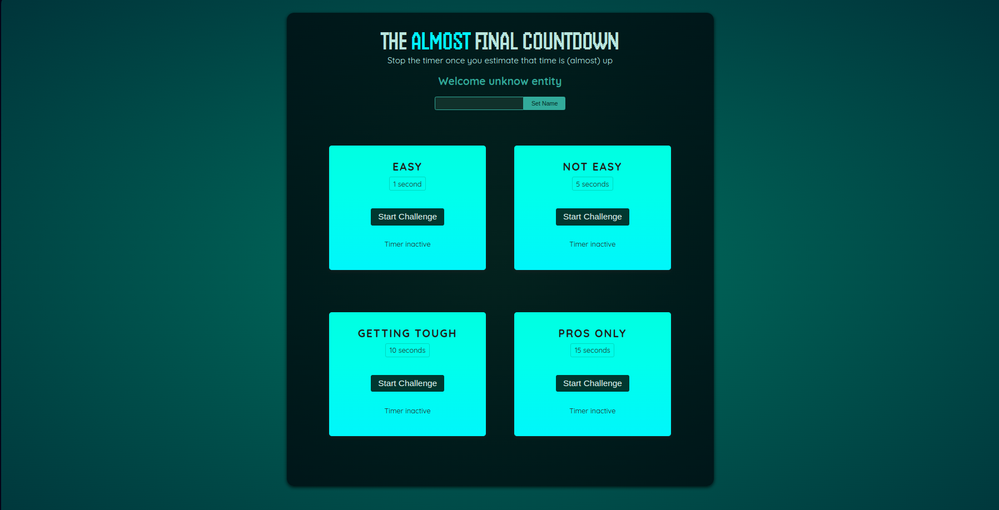

# 🎮 Time-stop challenge in React.js

Welcome to the Time-stop challengegame built with React!

Time-Stop Challenge is an interactive React.js game that tests your sense of time. The goal is simple: start a timer set to a specific duration (e.g., 5 seconds) and try to stop it exactly when that time elapses. Depending on your timing, you either lose or earn points—the closer you are to the target time, the higher your score!

## 🙋🏼‍♀️ Live demo:

[](https://ollawilk.github.io/stop-the-timer/)

## ✨ Features

    ✅ Timer Challenge: Multiple challenge levels (Easy, Not easy, Getting tough, Pros only) with varying target times.

    ✅ Dynamic Scoring: The app calculates and displays your score based on the remaining time when you stop the timer.

    ✅ Interactive Modal: A modal shows your result, including whether you lost and the exact time remaining. 
       The modal is rendered at the top of the DOM using a React Portal, ensuring it is never overlapped by 
       other UI elements.

    ✅ Player Name Setup: A simple player component allows you to set your name, which is then displayed as a welcome 
       message.

## 🚀 Technical Highlights

### useRef: 
Used for storing mutable values (e.g., timer and input references) without triggering re-renders.

### useState: 
Used for tracking state (e.g., time remaining, player name) that updates the UI.

### useImperativeHandle: 
Exposes imperative methods (like clear() on the form and open() on the modal) to parent components.

### React Portals: 
Ensures that the modal is rendered at the top of the DOM tree for better structure and to avoid any overlay issues.

## 🔧 How It Works

TimerChallenge Component:

1. Starts a timer using setInterval to update the remaining time.
2. When the timer is stopped (or when time runs out), the modal is triggered.
3. The modal shows whether you lost and the exact time left, and calculates your score based on your performance.

ResultModal Component:

1. Uses useImperativeHandle and a portal to expose an open() method.
2. Displays the target time, remaining time (formatted to two decimal places), and user score.

Player Component:

1. Allows the user to set and display their name using useRef and useState.

## 🦋 Installation project

**Clone the project:**

```
git clone https://github.com/OllaWilk/stop-the-timer.git
```

**Go to the project directory:**

```
cd stop-the-timer
```

**Install dependencies:**

```
npm install
```

**Start the server:**

```
npm start
```

🎉 Enjoy !
